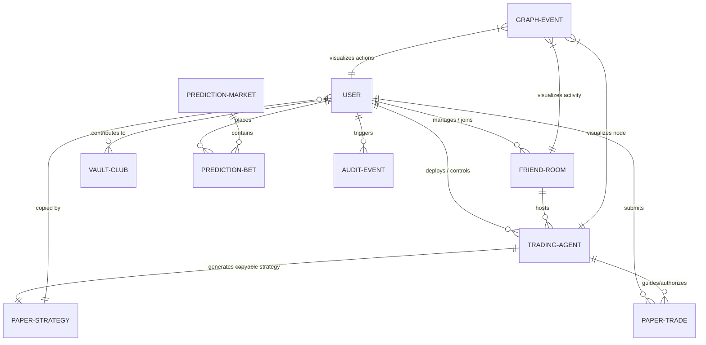

# MetaEdge Architectural Mindmap & Flow Analysis
`Version 1.0.0` • `System Connection & Logic Mapping`

This document maps all entity relationships, data flows, and state machines within the **MetaEdge** application. It serves as a visual guide to ensure there are no orphaned nodes or structural logic "dead-ends."

---

## 1. The Core Mindmap (Mermaid Entity Relationship Diagram)

This diagram outlines how every structural entity (Users, Rooms, Vaults, Agents, Trades, Predictions, and Graph Nodes) connects.



---

## 2. Dynamic Lifecycle & Transaction Flows

### A. The Agent-to-Strategy Copy-Trade Loop
```
[User Create Agent] 
       │
       ▼
[Check: Room ID specified?] ──(No)──► [Private Agent Created (Runs in Dashboard)]
       │ (Yes)
       ▼
[Active Agent Created]
       │
       ▼
[Auto-generate copyable Strategy] ──► [Listed globally under 'Strategies']
                                                 │
                                                 ▼
                                     [Another User clicks 'Copy']
                                                 │
                                                 ▼
                                     [Instantly Deploys Copied Bot]
```

### B. The Perpetuals Margin & Trade Execution Loop
```
[Select Active Bot] ──► [Set Asset: BTC/ETH/SOL/LINK/DOGE]
                               │
                               ▼
                        [Set Side & Size]
                               │
                               ▼
               [Select Spot Token OR Perp Futures]
                               │
                               ▼
           [If Perp Futures: Select Leverage (1x-20x)]
                               │
                               ▼
            [Calculate Margin & Liquidation Boundary]
                               │
                               ▼
                  [Submit Order / Check Balance]
                               │
                               ▼
               [Write Trade Record & Deduct Balance]
```

---

## 3. Resolving Logic "Dead-Ends"

We have audited the flow to ensure that all user actions are fully cyclic:

| Potential Dead-End | Safeguard Implemented | Status |
| :--- | :--- | :--- |
| **Orphaned Agent** | An agent created inside a room automatically ties to that room. If the room is closed or left, the agent can still be managed privately or deleted permanently. | **Resolved** |
| **Locked Paper Funds** | If a user runs out of paper funds due to a bad trade, they can claim from the faucet ($50,000 credit) up to 10 times to reset. | **Resolved** |
| **Unlinked Strategies** | Deleting an agent permanently cleans up its active shared strategies to avoid "ghost strategies" with no active bot engine. | **Resolved** |
| **Isolated Trade History** | User can now selectively delete individual trade rows or clear their entire paper trading history with a single click. | **Resolved** |
